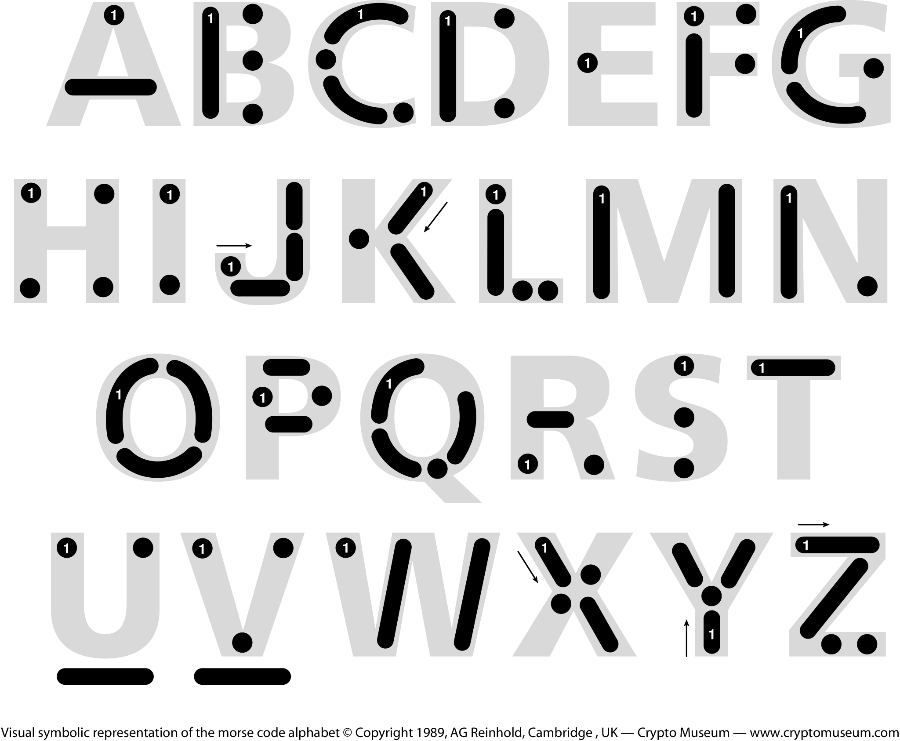

# Décoder du code morse

## Instructions

Écrire une fonction qui prend en entrée du code morse et le convertit en caractères lisibles par l’homme.

Le morse est composé de succession de points et de tirets. Chaque lettre est séparée par un espace, chaque mot par 3 espaces.

- La fonction est déjà prête dans la classe `src/Morse.php`, méthode `convertToLetters()`.  
- Le tableau contenant le code morse est fourni dans cette même classe grâce à la constante `MORSE`.

Exemple :  
```php
$morse->convertToLetters('.--'); // retourne 'W' 
$morse->convertToLetters('.-- ..'); // retourne 'WI'
```

## Tester la fonction dans le terminal
1. Installer PHPUnit avec la commande
```bash
composer install
```
2. Lancer les tests déjà en place dans `tests/MorseTest.php` avec la commande
```bash
php ./vendor/bin/phpunit ./tests/MorseTest.php
```
